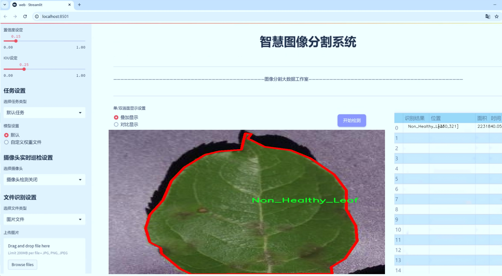
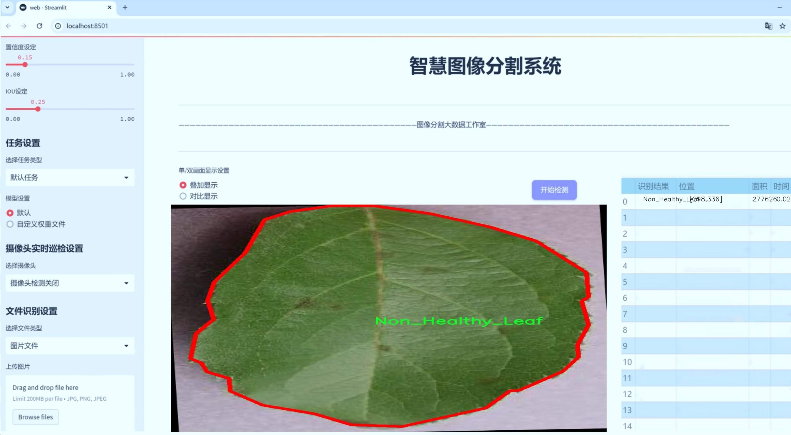
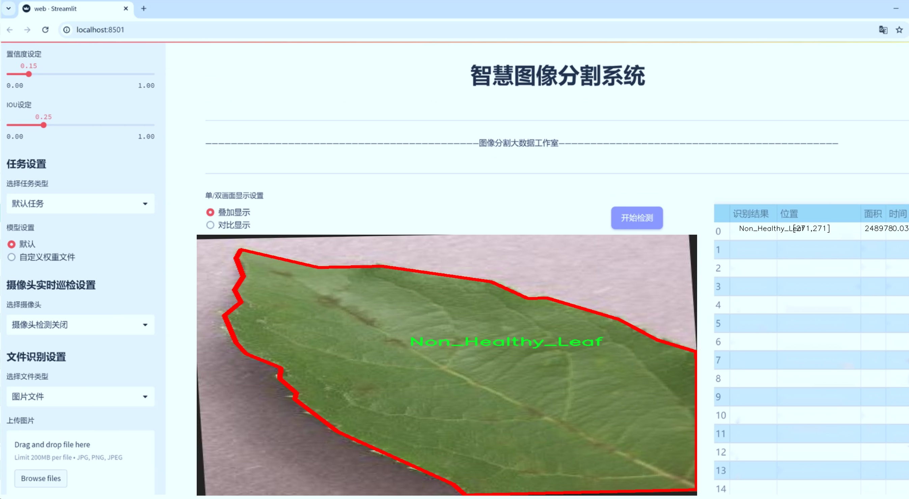
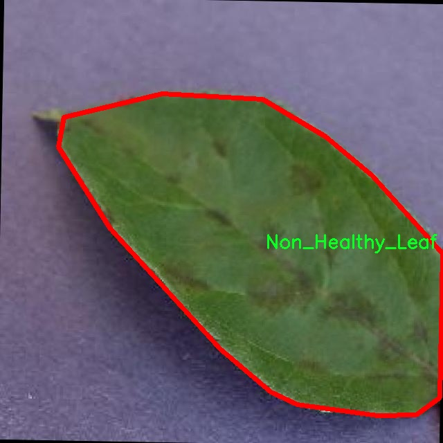
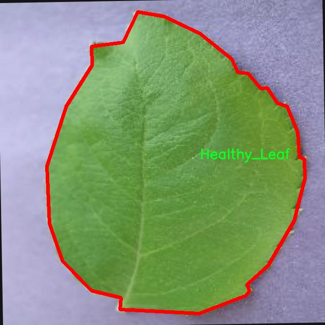
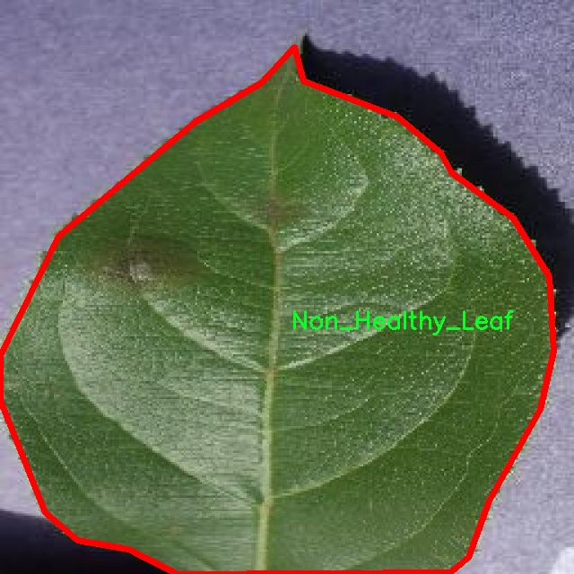
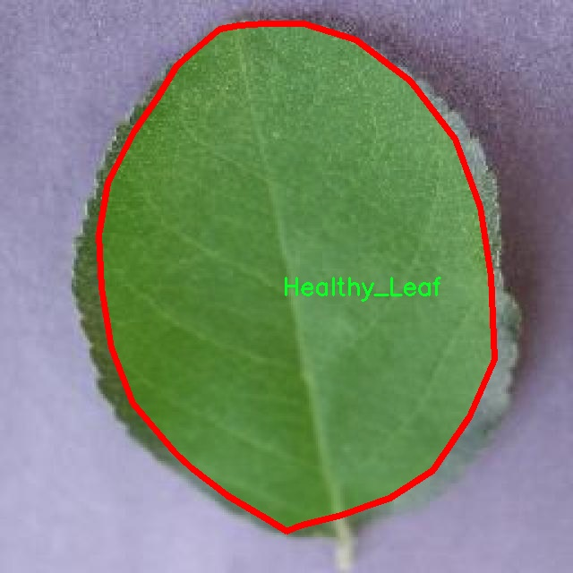
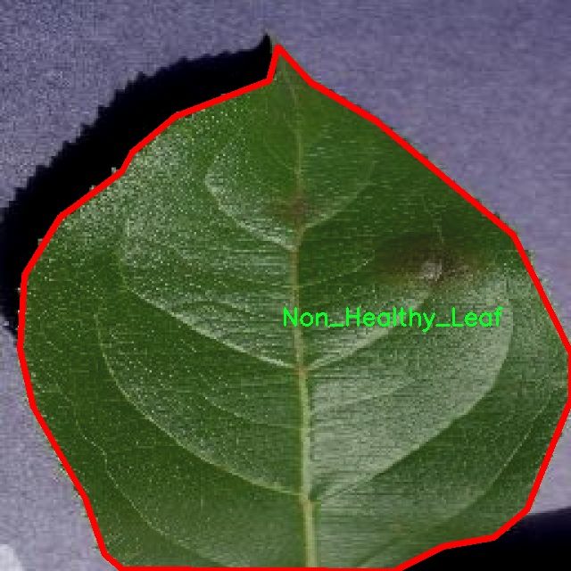

# 健康与非健康叶片分割系统： yolov8-seg-C2f-OREPA

### 1.研究背景与意义

[参考博客](https://gitee.com/YOLOv8_YOLOv11_Segmentation_Studio/projects)

[博客来源](https://kdocs.cn/l/cszuIiCKVNis)

研究背景与意义

随着全球气候变化和环境污染的加剧，植物健康状况的监测与评估变得愈发重要。植物不仅是生态系统的重要组成部分，也是人类生存和发展的基础。健康的植物能够有效地进行光合作用，提供氧气和食物，而病害或非健康植物则可能导致生态失衡、农作物减产，甚至影响人类的食品安全。因此，及时、准确地识别和分割健康与非健康叶片，对于农业生产、生态保护及相关研究具有重要的现实意义。

近年来，深度学习技术的迅猛发展为图像处理和计算机视觉领域带来了新的机遇，尤其是在目标检测和实例分割方面。YOLO（You Only Look Once）系列模型因其高效性和准确性而广泛应用于各种视觉任务。YOLOv8作为该系列的最新版本，进一步提升了模型的性能，特别是在处理复杂场景和小目标检测方面。基于YOLOv8的健康与非健康叶片分割系统，能够有效地从图像中提取出健康叶片和非健康叶片的特征，进而实现精确的实例分割，为后续的分析和决策提供数据支持。

本研究所使用的数据集包含1000张图像，分为健康叶片和非健康叶片两类。这一数据集的构建为模型的训练和验证提供了坚实的基础。通过对这两类叶片的图像进行标注和分类，研究者能够利用深度学习技术训练出高效的分割模型，从而实现对植物健康状况的自动化监测。这不仅能够提高农业生产的效率，还能为植物病害的早期预警提供有力支持。

此外，健康与非健康叶片的分割研究还有助于推动植物病害诊断和精准农业的发展。通过对叶片健康状况的实时监测，农民可以及时采取措施，防止病害的扩散，降低农药的使用，促进可持续农业的发展。同时，基于改进YOLOv8的分割系统还可以为科研人员提供更加精确的数据，助力植物生理学、生态学等领域的研究。

综上所述，基于改进YOLOv8的健康与非健康叶片分割系统不仅具有重要的学术价值，还具有广泛的应用前景。通过对植物健康状况的自动化监测与分析，本研究将为农业生产、生态保护及相关领域的研究提供新的思路和方法，推动植物科学的进步与发展。

### 2.图片演示







注意：本项目提供完整的训练源码数据集和训练教程,由于此博客编辑较早,暂不提供权重文件（best.pt）,需要按照6.训练教程进行训练后实现上图效果。

### 3.视频演示

[3.1 视频演示](https://www.bilibili.com/video/BV1S8meYTESW/)

### 4.数据集信息

##### 4.1 数据集类别数＆类别名

nc: 2
names: ['Healthy_Leaf', 'Non_Healthy_Leaf']


##### 4.2 数据集信息简介

数据集信息展示

在植物病害检测和分类的研究中，叶片的健康状况是一个至关重要的指标。为此，我们构建了一个名为“Healthy-and-NonHealthy-leaves”的数据集，旨在为改进YOLOv8-seg模型提供高质量的训练数据，以实现对健康与非健康叶片的精准分割。该数据集的设计充分考虑了叶片的多样性和复杂性，涵盖了不同种类植物的健康和非健康状态，以便于模型在实际应用中具备更强的泛化能力。

“Healthy-and-NonHealthy-leaves”数据集包含两个主要类别：健康叶片（Healthy_Leaf）和非健康叶片（Non_Healthy_Leaf）。这两个类别的划分不仅基于叶片的外观特征，还考虑了不同病害对叶片的影响。健康叶片通常呈现出鲜艳的绿色，表面光滑，叶脉清晰可见，且没有明显的病斑或枯萎现象。而非健康叶片则可能表现出不同程度的黄化、斑点、枯萎或其他病害特征，这些特征为模型的训练提供了丰富的样本。

在数据集的构建过程中，我们注重样本的多样性和代表性，确保每个类别都包含足够数量的图像，以反映不同生长环境、气候条件和植物种类下的叶片健康状况。通过对不同植物种类的叶片进行采集和标注，我们的数据集不仅涵盖了常见的经济作物，还包括一些野生植物，从而为模型的训练提供了广泛的背景信息。

为了确保数据集的高质量，我们采用了严格的图像采集和标注流程。所有图像均在自然光照条件下拍摄，以减少光照变化对叶片颜色和纹理的影响。同时，标注过程中，我们使用了专业的图像标注工具，确保每一张图像中的叶片区域都被准确标记，避免了标注错误对模型训练的负面影响。

数据集的规模也经过精心设计，以便于训练深度学习模型。我们确保每个类别的样本数量相对均衡，以防止模型在训练过程中出现偏倚。通过这种方式，我们希望模型能够更好地学习到健康与非健康叶片之间的微妙差异，从而在实际应用中实现更高的识别准确率。

在模型训练阶段，我们将“Healthy-and-NonHealthy-leaves”数据集分为训练集、验证集和测试集，以便于对模型的性能进行全面评估。训练集用于模型的学习，验证集用于调优超参数，而测试集则用于最终的性能评估。通过这种系统化的训练和评估流程，我们期望最终构建出一个高效的叶片分割系统，能够在实际农业生产中提供及时的病害检测和预警服务。

总之，“Healthy-and-NonHealthy-leaves”数据集的构建为改进YOLOv8-seg模型提供了坚实的基础，助力于实现高效的健康与非健康叶片分割。这一数据集不仅在学术研究中具有重要价值，也为农业生产的智能化发展提供了有力支持。











### 5.项目依赖环境部署教程（零基础手把手教学）

[5.1 环境部署教程链接（零基础手把手教学）](https://www.bilibili.com/video/BV1jG4Ve4E9t/?vd_source=bc9aec86d164b67a7004b996143742dc)


[5.2 安装Python虚拟环境创建和依赖库安装视频教程链接（零基础手把手教学）](https://www.bilibili.com/video/BV1nA4VeYEze/?vd_source=bc9aec86d164b67a7004b996143742dc)

### 6.手把手YOLOV8-seg训练视频教程（零基础手把手教学）

[6.1 手把手YOLOV8-seg训练视频教程（零基础小白有手就能学会）](https://www.bilibili.com/video/BV1cA4VeYETe/?vd_source=bc9aec86d164b67a7004b996143742dc)


按照上面的训练视频教程链接加载项目提供的数据集，运行train.py即可开始训练



     Epoch   gpu_mem       box       obj       cls    labels  img_size
     1/200     0G   0.01576   0.01955  0.007536        22      1280: 100%|██████████| 849/849 [14:42<00:00,  1.04s/it]
               Class     Images     Labels          P          R     mAP@.5 mAP@.5:.95: 100%|██████████| 213/213 [01:14<00:00,  2.87it/s]
                 all       3395      17314      0.994      0.957      0.0957      0.0843

     Epoch   gpu_mem       box       obj       cls    labels  img_size
     2/200     0G   0.01578   0.01923  0.007006        22      1280: 100%|██████████| 849/849 [14:44<00:00,  1.04s/it]
               Class     Images     Labels          P          R     mAP@.5 mAP@.5:.95: 100%|██████████| 213/213 [01:12<00:00,  2.95it/s]
                 all       3395      17314      0.996      0.956      0.0957      0.0845

     Epoch   gpu_mem       box       obj       cls    labels  img_size
     3/200     0G   0.01561    0.0191  0.006895        27      1280: 100%|██████████| 849/849 [10:56<00:00,  1.29it/s]
               Class     Images     Labels          P          R     mAP@.5 mAP@.5:.95: 100%|███████   | 187/213 [00:52<00:00,  4.04it/s]
                 all       3395      17314      0.996      0.957      0.0957      0.0845


### 7.50+种全套YOLOV8-seg创新点加载调参实验视频教程（一键加载写好的改进模型的配置文件）

[7.1 50+种全套YOLOV8-seg创新点加载调参实验视频教程（一键加载写好的改进模型的配置文件）](https://www.bilibili.com/video/BV1Hw4VePEXv/?vd_source=bc9aec86d164b67a7004b996143742dc)

### YOLOV8-seg算法简介

原始YOLOv8-seg算法原理

YOLOv8-seg算法是YOLO系列的最新进展，专注于目标检测与分割任务的高效解决。作为一种单阶段检测算法，YOLOv8-seg在检测精度和速度上均表现出显著的优势，标志着深度学习在计算机视觉领域的又一次突破。该算法的设计旨在处理复杂的视觉任务，通过对图像进行全面的分析，提供高质量的目标分割和定位信息。

YOLOv8-seg的网络结构主要由四个核心部分组成：输入层、Backbone骨干网络、Neck特征融合网络和Head检测模块。输入层负责对图像进行预处理，包括调整图像比例、进行Mosaic增强以及计算锚点。这一过程不仅提升了模型的鲁棒性，还为后续的特征提取奠定了基础。Mosaic增强技术通过将多张图像拼接成一张新图像，增加了训练数据的多样性，从而提高了模型的泛化能力。

在Backbone部分，YOLOv8-seg采用了改进的DarkNet结构，特别是C2f模块的引入，使得特征提取过程更加高效。C2f模块通过引入更多的分支和跨层连接，增强了模型的梯度流动能力，确保了特征信息的充分保留与传递。这一结构的设计不仅提高了特征表示能力，还保持了模型的轻量级特性，使得YOLOv8-seg在处理复杂场景时依然能够保持较高的实时性。

特征图的处理通过SPPF（Spatial Pyramid Pooling Fusion）模块进行，该模块利用不同内核尺寸的池化操作对特征图进行合并，进一步增强了特征的抽象能力。通过对多尺度特征的融合，YOLOv8-seg能够更好地应对不同尺寸目标的检测与分割任务，确保了模型在各种场景下的适应性。

Neck部分采用了双塔结构，结合了特征金字塔网络（FPN）和路径聚合网络（PAN），极大地增强了网络对不同尺度目标的特征融合能力。FPN通过自上而下的特征传递，将高层语义信息与低层细节信息结合，确保了目标检测的准确性；而PAN则通过自下而上的路径聚合，强化了特征的传递与融合。这种双塔结构的设计，使得YOLOv8-seg在处理复杂背景和遮挡情况时，依然能够保持高效的特征提取能力。

在Head模块中，YOLOv8-seg采用了解耦头的结构，将目标检测与分类过程分离。这一设计的优势在于可以独立优化分类和回归任务，从而加速模型的收敛速度。解耦头结构通过两个并行的卷积分支，分别计算回归和分类的损失，使得模型在训练过程中能够更好地学习到目标的边界框信息和类别特征。此外，YOLOv8-seg引入了无锚框检测头，减少了锚框预测的数量，进而加快了非最大抑制（NMS）过程，提升了整体检测效率。

在损失计算方面，YOLOv8-seg采用了Task-Aligned Assigner策略，根据分类与回归的分数加权结果选择正样本。这一策略的引入，使得模型在训练过程中能够更有效地分配样本，提高了正负样本的利用率。同时，分类分支使用二元交叉熵损失（BCELoss）进行训练，而回归分支则结合了分布焦点损失（DFLoss）和完全交并比损失函数（CIOULoss），以提升模型对边界框预测的精准性。这种多样化的损失计算方式，使得YOLOv8-seg在面对复杂的目标分割任务时，能够实现更高的精度和稳定性。

综上所述，YOLOv8-seg算法通过对网络结构的精心设计与优化，成功地实现了目标检测与分割任务的高效处理。其在Backbone、Neck和Head模块的创新设计，使得模型不仅具备了出色的特征提取能力，还能够在实时性和精度之间取得良好的平衡。随着YOLOv8-seg的不断发展与应用，其在各类计算机视觉任务中的潜力将会被进一步挖掘，为未来的研究与应用提供更多的可能性。


### 9.系统功能展示（检测对象为举例，实际内容以本项目数据集为准）

图9.1.系统支持检测结果表格显示

  图9.2.系统支持置信度和IOU阈值手动调节

  图9.3.系统支持自定义加载权重文件best.pt(需要你通过步骤5中训练获得)

  图9.4.系统支持摄像头实时识别

  图9.5.系统支持图片识别

  图9.6.系统支持视频识别

  图9.7.系统支持识别结果文件自动保存

  图9.8.系统支持Excel导出检测结果数据


### 10.50+种全套YOLOV8-seg创新点原理讲解（非科班也可以轻松写刊发刊，V11版本正在科研待更新）

#### 10.1 由于篇幅限制，每个创新点的具体原理讲解就不一一展开，具体见下列网址中的创新点对应子项目的技术原理博客网址【Blog】：


[10.1 50+种全套YOLOV8-seg创新点原理讲解链接](https://gitee.com/qunmasj/good)

#### 10.2 部分改进模块原理讲解(完整的改进原理见上图和技术博客链接)【如果此小节的图加载失败可以通过CSDN或者Github搜索该博客的标题访问原始博客，原始博客图片显示正常】
### YOLOv8简介
#### Neck模块设计
骨干网络和 Neck 的具体变化为：

第一个卷积层的 kernel 从 6x6 变成了 3x3
所有的 C3 模块换成 C2f，结构如下所示，可以发现多了更多的跳层连接和额外的 Split 操作


去掉了 Neck 模块中的 2 个卷积连接层
Backbone 中 C2f 的 block 数从 3-6-9-3 改成了 3-6-6-3
查看 N/S/M/L/X 等不同大小模型，可以发现 N/S 和 L/X 两组模型只是改了缩放系数，但是 S/M/L 等骨干网络的通道数设置不一样，没有遵循同一套缩放系数。如此设计的原因应该是同一套缩放系数下的通道设置不是最优设计，YOLOv7 网络设计时也没有遵循一套缩放系数作用于所有模型。

#### Head模块设计
Head 部分变化最大，从原先的耦合头变成了解耦头，并且从 YOLOv5 的 Anchor-Based 变成了 Anchor-Free。其结构如下所示：


可以看出，不再有之前的 objectness 分支，只有解耦的分类和回归分支，并且其回归分支使用了 Distribution Focal Loss 中提出的积分形式表示法。

#### Loss 计算
Loss 计算过程包括 2 个部分： 正负样本分配策略和 Loss 计算。 现代目标检测器大部分都会在正负样本分配策略上面做文章，典型的如 YOLOX 的 simOTA、TOOD 的 TaskAlignedAssigner 和 RTMDet 的 DynamicSoftLabelAssigner，这类 Assigner 大都是动态分配策略，而 YOLOv5 采用的依然是静态分配策略。考虑到动态分配策略的优异性，YOLOv8 算法中则直接引用了 TOOD 的 TaskAlignedAssigner。 TaskAlignedAssigner 的匹配策略简单总结为： 根据分类与回归的分数加权的分数选择正样本。

s 是标注类别对应的预测分值，u 是预测框和 gt 框的 iou，两者相乘就可以衡量对齐程度。

对于每一个 GT，对所有的预测框基于 GT 类别对应分类分数，预测框与 GT 的 IoU 的加权得到一个关联分类以及回归的对齐分数 alignment_metrics 。
对于每一个 GT，直接基于 alignment_metrics 对齐分数选取 topK 大的作为正样本
Loss 计算包括 2 个分支： 分类和回归分支，没有了之前的 objectness 分支。
分类分支依然采用 BCE Loss
回归分支需要和 Distribution Focal Loss 中提出的积分形式表示法绑定，因此使用了 Distribution Focal Loss， 同时还使用了 CIoU Loss
Loss 采用一定权重比例加权即可。
#### 训练数据增强
数据增强方面和 YOLOv5 差距不大，只不过引入了 YOLOX 中提出的最后 10 个 epoch 关闭 Mosaic 的操作。假设训练 epoch 是 500，其示意图如下所示：

### RCS-OSA的基本原理
参考该博客，RCSOSA（RCS-One-Shot Aggregation）是RCS-YOLO中提出的一种结构，我们可以将主要原理概括如下：

1. RCS（Reparameterized Convolution based on channel Shuffle）: 结合了通道混洗，通过重参数化卷积来增强网络的特征提取能力。

2. RCS模块: 在训练阶段，利用多分支结构学习丰富的特征表示；在推理阶段，通过结构化重参数化简化为单一分支，减少内存消耗。

3. OSA（One-Shot Aggregation）: 一次性聚合多个特征级联，减少网络计算负担，提高计算效率。

4. 特征级联: RCS-OSA模块通过堆叠RCS，确保特征的复用并加强不同层之间的信息流动。

#### RCS
RCS（基于通道Shuffle的重参数化卷积）是RCS-YOLO的核心组成部分，旨在训练阶段通过多分支结构学习丰富的特征信息，并在推理阶段通过简化为单分支结构来减少内存消耗，实现快速推理。此外，RCS利用通道分割和通道Shuffle操作来降低计算复杂性，同时保持通道间的信息交换，这样在推理阶段相比普通的3×3卷积可以减少一半的计算复杂度。通过结构重参数化，RCS能够在训练阶段从输入特征中学习深层表示，并在推理阶段实现快速推理，同时减少内存消耗。

#### RCS模块
RCS（基于通道Shuffle的重参数化卷积）模块中，结构在训练阶段使用多个分支，包括1x1和3x3的卷积，以及一个直接的连接（Identity），用于学习丰富的特征表示。在推理阶段，结构被重参数化成一个单一的3x3卷积，以减少计算复杂性和内存消耗，同时保持训练阶段学到的特征表达能力。这与RCS的设计理念紧密相连，即在不牺牲性能的情况下提高计算效率。


上图为大家展示了RCS的结构，分为训练阶段（a部分）和推理阶段（b部分）。在训练阶段，输入通过通道分割，一部分输入经过RepVGG块，另一部分保持不变。然后通过1x1卷积和3x3卷积处理RepVGG块的输出，与另一部分输入进行通道Shuffle和连接。在推理阶段，原来的多分支结构被简化为一个单一的3x3 RepConv块。这种设计允许在训练时学习复杂特征，在推理时减少计算复杂度。黑色边框的矩形代表特定的模块操作，渐变色的矩形代表张量的特定特征，矩形的宽度代表张量的通道数。 

#### OSA
OSA（One-Shot Aggregation）是一个关键的模块，旨在提高网络在处理密集连接时的效率。OSA模块通过表示具有多个感受野的多样化特征，并在最后的特征映射中仅聚合一次所有特征，从而克服了DenseNet中密集连接的低效率问题。

OSA模块的使用有两个主要目的：

1. 提高特征表示的多样性：OSA通过聚合具有不同感受野的特征来增加网络对于不同尺度的敏感性，这有助于提升模型对不同大小目标的检测能力。

2. 提高效率：通过在网络的最后一部分只进行一次特征聚合，OSA减少了重复的特征计算和存储需求，从而提高了网络的计算和能源效率。

在RCS-YOLO中，OSA模块被进一步与RCS（基于通道Shuffle的重参数化卷积）相结合，形成RCS-OSA模块。这种结合不仅保持了低成本的内存消耗，而且还实现了语义信息的有效提取，对于构建轻量级和大规模的对象检测器尤为重要。

下面我将为大家展示RCS-OSA（One-Shot Aggregation of RCS）的结构。


在RCS-OSA模块中，输入被分为两部分，一部分直接通过，另一部分通过堆叠的RCS模块进行处理。处理后的特征和直接通过的特征在通道混洗（Channel Shuffle）后合并。这种结构设计用于增强模型的特征提取和利用效率，是RCS-YOLO架构中的一个关键组成部分旨在通过一次性聚合来提高模型处理特征的能力，同时保持计算效率。

#### 特征级联
特征级联（feature cascade）是一种技术，通过在网络的一次性聚合（one-shot aggregate）路径上维持有限数量的特征级联来实现的。在RCS-YOLO中，特别是在RCS-OSA（RCS-Based One-Shot Aggregation）模块中，只保留了三个特征级联。

特征级联的目的是为了减轻网络计算负担并降低内存占用。这种方法可以有效地聚合不同层次的特征，提高模型的语义信息提取能力，同时避免了过度复杂化网络结构所带来的低效率和高资源消耗。

下面为大家提供的图像展示的是RCS-YOLO的整体架构，其中包括RCS-OSA模块。RCS-OSA在模型中用于堆叠RCS模块，以确保特征的复用并加强不同层之间的信息流动。图中显示的多层RCS-OSA模块的排列和组合反映了它们如何一起工作以优化特征传递和提高检测性能。


总结：RCS-YOLO主要由RCS-OSA（蓝色模块）和RepVGG（橙色模块）构成。这里的n代表堆叠RCS模块的数量。n_cls代表检测到的对象中的类别数量。图中的IDetect是从YOLOv7中借鉴过来的，表示使用二维卷积神经网络的检测层。这个架构通过堆叠的RCS模块和RepVGG模块，以及两种类型的检测层，实现了对象检测的任务。 


### 11.项目核心源码讲解（再也不用担心看不懂代码逻辑）

#### 11.1 ultralytics\nn\extra_modules\head.py

以下是对给定代码的核心部分进行分析和注释。代码主要实现了YOLOv8的检测头，包括不同类型的检测头（如Detect_DyHead、Detect_AFPN等），并提供了前向传播、偏置初始化等功能。

```python
import math
import torch
import torch.nn as nn
from torch.nn.init import constant_, xavier_uniform_

# 导入必要的模块和函数

class Detect_DyHead(nn.Module):
    """YOLOv8 检测头，使用动态头进行检测模型。"""
    
    def __init__(self, nc=80, hidc=256, block_num=2, ch=()):
        """初始化检测头的参数。
        
        参数:
        nc: 类别数量
        hidc: 隐藏层通道数
        block_num: 动态头块的数量
        ch: 输入通道数
        """
        super().__init__()
        self.nc = nc  # 类别数量
        self.nl = len(ch)  # 检测层数量
        self.reg_max = 16  # DFL通道数
        self.no = nc + self.reg_max * 4  # 每个锚点的输出数量
        self.stride = torch.zeros(self.nl)  # 构建时计算的步幅
        c2, c3 = max((16, ch[0] // 4, self.reg_max * 4)), max(ch[0], self.nc)  # 通道数
        self.conv = nn.ModuleList(nn.Sequential(Conv(x, hidc, 1)) for x in ch)  # 卷积层
        self.dyhead = nn.Sequential(*[DyHeadBlock(hidc) for _ in range(block_num)])  # 动态头块
        self.cv2 = nn.ModuleList(
            nn.Sequential(Conv(hidc, c2, 3), Conv(c2, c2, 3), nn.Conv2d(c2, 4 * self.reg_max, 1)) for _ in ch)  # 输出框的卷积层
        self.cv3 = nn.ModuleList(nn.Sequential(Conv(hidc, c3, 3), Conv(c3, c3, 3), nn.Conv2d(c3, self.nc, 1)) for _ in ch)  # 类别的卷积层
        self.dfl = DFL(self.reg_max) if self.reg_max > 1 else nn.Identity()  # DFL层

    def forward(self, x):
        """连接并返回预测的边界框和类别概率。"""
        for i in range(self.nl):
            x[i] = self.conv[i](x[i])  # 对每个输入应用卷积
        x = self.dyhead(x)  # 通过动态头处理
        shape = x[0].shape  # 获取输出形状
        for i in range(self.nl):
            x[i] = torch.cat((self.cv2[i](x[i]), self.cv3[i](x[i])), 1)  # 连接框和类别的输出
        if self.training:
            return x  # 训练模式下返回原始输出
        # 动态模式或形状变化时重新计算锚点和步幅
        if self.dynamic or self.shape != shape:
            self.anchors, self.strides = (x.transpose(0, 1) for x in make_anchors(x, self.stride, 0.5))
            self.shape = shape

        x_cat = torch.cat([xi.view(shape[0], self.no, -1) for xi in x], 2)  # 合并所有输出
        box, cls = x_cat.split((self.reg_max * 4, self.nc), 1)  # 分割边界框和类别
        dbox = dist2bbox(self.dfl(box), self.anchors.unsqueeze(0), xywh=True, dim=1) * self.strides  # 计算最终边界框
        y = torch.cat((dbox, cls.sigmoid()), 1)  # 合并边界框和类别概率
        return y if self.export else (y, x)  # 根据导出模式返回

    def bias_init(self):
        """初始化检测头的偏置，警告：需要步幅可用。"""
        for a, b, s in zip(self.cv2, self.cv3, self.stride):  # 遍历卷积层
            a[-1].bias.data[:] = 1.0  # 边界框偏置初始化
            b[-1].bias.data[:self.nc] = math.log(5 / self.nc / (640 / s) ** 2)  # 类别偏置初始化

# 其他检测头类（如Detect_AFPN_P345、Detect_Efficient等）类似，主要结构和功能一致，略去详细实现
```

### 核心部分分析
1. **Detect_DyHead类**: 这是YOLOv8的主要检测头，负责处理输入特征并生成边界框和类别概率。它使用了动态头块（DyHeadBlock）来增强特征提取能力。
2. **forward方法**: 该方法实现了前向传播逻辑，包括特征处理、锚点生成和最终输出的构建。
3. **bias_init方法**: 用于初始化模型的偏置，确保模型在训练开始时有合理的初始值。

### 总结
代码实现了YOLOv8检测头的多个变种，提供了灵活的特征处理和输出生成方式。通过合理的模块化设计，便于扩展和修改。

这个文件是一个实现YOLOv8检测头的PyTorch模块，主要用于目标检测任务。代码中定义了多个类，每个类代表不同的检测头，主要包括动态头（Dynamic Head）、自适应特征金字塔网络（AFPN）以及高效检测头（Efficient Head）等。以下是对代码的逐部分分析。

首先，文件导入了一些必要的库和模块，包括数学库、PyTorch的神经网络模块以及一些自定义的模块，如卷积层（Conv）、DFL（分布式特征学习）、C2f、RepConv等。这些模块为构建YOLOv8的检测头提供了基础。

接下来，定义了`Detect_DyHead`类，这是YOLOv8的动态检测头。该类的构造函数初始化了一些参数，包括类别数量、隐藏通道数、块的数量等。它还定义了多个卷积层和动态头块（DyHeadBlock），这些层用于处理输入特征图并生成预测结果。在前向传播方法中，输入特征图经过一系列卷积和动态头块处理后，最终输出边界框和类别概率。

`Detect_DyHeadWithDCNV3`类继承自`Detect_DyHead`，并使用了DCN（Deformable Convolutional Networks）进行改进，以提高检测性能。

`Detect_AFPN_P345`和`Detect_AFPN_P2345`类实现了自适应特征金字塔网络（AFPN），它们的构造函数中调用了AFPN模块，并定义了卷积层用于生成边界框和类别预测。AFPN通过不同层次的特征融合来提高检测精度。

`Detect_Efficient`类实现了高效检测头，采用了不同的卷积结构来减少计算量并提高速度。它的前向传播方法与之前的检测头类似，但使用了更高效的卷积层组合。

`DetectAux`类是一个辅助检测头，主要用于多任务学习，能够同时处理主任务和辅助任务的输出。它在构造函数中定义了两个卷积路径，分别用于主任务和辅助任务的特征提取。

最后，`Segment_Efficient`类是用于分割任务的检测头，继承自`Detect_Efficient`，并增加了用于生成掩码的原型（Proto）模块。它的前向传播方法同时返回检测结果和掩码系数。

整个文件的设计体现了YOLOv8在目标检测中的灵活性和高效性，通过不同的检测头和模块组合，能够适应多种检测需求和场景。

#### 11.2 ultralytics\engine\trainer.py

以下是经过简化和注释的核心代码部分，主要关注训练模型的逻辑和流程。

```python
class BaseTrainer:
    """
    BaseTrainer类是用于训练模型的基类，包含训练过程中的主要逻辑和方法。
    """

    def __init__(self, cfg=DEFAULT_CFG, overrides=None, _callbacks=None):
        """
        初始化BaseTrainer类。

        参数:
            cfg (str, optional): 配置文件路径，默认为DEFAULT_CFG。
            overrides (dict, optional): 配置覆盖，默认为None。
        """
        # 获取配置
        self.args = get_cfg(cfg, overrides)
        self.check_resume(overrides)  # 检查是否需要从检查点恢复训练
        self.device = select_device(self.args.device, self.args.batch)  # 选择训练设备
        self.model = None  # 模型实例
        self.trainset, self.testset = self.get_dataset(self.args.data)  # 获取训练和测试数据集

        # 初始化其他参数
        self.epochs = self.args.epochs  # 训练的总轮数
        self.batch_size = self.args.batch  # 批次大小
        self.best_fitness = None  # 最佳适应度
        self.loss = None  # 当前损失值

    def train(self):
        """开始训练过程。"""
        world_size = self._get_world_size()  # 获取世界大小（即GPU数量）

        if world_size > 1 and 'LOCAL_RANK' not in os.environ:
            # 如果是多GPU训练，生成DDP命令并运行
            cmd, file = generate_ddp_command(world_size, self)
            subprocess.run(cmd, check=True)  # 运行命令
            ddp_cleanup(self, str(file))  # 清理DDP

        else:
            self._do_train(world_size)  # 单GPU训练

    def _do_train(self, world_size=1):
        """执行训练的主要逻辑。"""
        self._setup_train(world_size)  # 设置训练环境

        for epoch in range(self.epochs):
            self.model.train()  # 设置模型为训练模式
            for i, batch in enumerate(self.train_loader):  # 遍历训练数据
                self.optimizer.zero_grad()  # 清空梯度
                self.loss, self.loss_items = self.model(batch)  # 前向传播计算损失
                self.loss.backward()  # 反向传播
                self.optimizer.step()  # 更新优化器

            # 每个epoch结束后进行验证和保存模型
            self.validate()  # 验证模型
            self.save_model()  # 保存模型

    def validate(self):
        """在验证集上进行验证并返回指标。"""
        metrics = self.validator(self)  # 调用验证器
        fitness = metrics.pop('fitness', -self.loss.detach().cpu().numpy())  # 获取适应度
        if not self.best_fitness or self.best_fitness < fitness:
            self.best_fitness = fitness  # 更新最佳适应度
        return metrics, fitness

    def save_model(self):
        """保存模型和训练检查点。"""
        ckpt = {
            'epoch': self.epoch,
            'best_fitness': self.best_fitness,
            'model': deepcopy(self.model).half(),  # 深拷贝模型并转换为半精度
            'optimizer': self.optimizer.state_dict(),  # 保存优化器状态
            'train_args': vars(self.args),  # 保存训练参数
        }
        torch.save(ckpt, self.last)  # 保存最后的检查点
        if self.best_fitness == self.fitness:
            torch.save(ckpt, self.best)  # 保存最佳检查点

    def _get_world_size(self):
        """获取当前可用的GPU数量。"""
        if isinstance(self.args.device, str):
            return len(self.args.device.split(','))
        elif isinstance(self.args.device, (tuple, list)):
            return len(self.args.device)
        elif torch.cuda.is_available():
            return 1  # 默认使用一个GPU
        else:
            return 0  # 没有可用的GPU

    def get_dataset(self, data):
        """从数据字典中获取训练和验证路径。"""
        return data['train'], data.get('val') or data.get('test')
```

### 代码说明：
1. **BaseTrainer类**：这是一个训练模型的基类，包含了训练的主要逻辑和方法。
2. **初始化方法**：获取配置，检查是否需要恢复训练，选择设备，并获取训练和测试数据集。
3. **train方法**：开始训练过程，支持多GPU训练。
4. **_do_train方法**：执行训练的主要逻辑，包括前向传播、反向传播和优化步骤。
5. **validate方法**：在验证集上进行验证并更新最佳适应度。
6. **save_model方法**：保存模型和训练检查点。
7. **_get_world_size方法**：获取当前可用的GPU数量。
8. **get_dataset方法**：从数据字典中获取训练和验证路径。

这个简化版本保留了训练过程的核心逻辑，并对每个部分进行了详细的中文注释。

这个程序文件是Ultralytics YOLO框架中的一个训练器类（`BaseTrainer`），用于在给定的数据集上训练YOLO模型。文件中包含了训练过程的各个环节，从模型的初始化、数据集的准备，到训练过程中的优化、验证和模型保存等功能。

首先，文件中导入了必要的库和模块，包括数学运算、文件操作、时间处理、深度学习框架PyTorch的相关模块，以及Ultralytics框架中的一些工具函数和类。接着，定义了`BaseTrainer`类，类的构造函数接收配置参数并进行初始化。它会检查是否需要从之前的检查点恢复训练，并根据设备类型选择训练所用的设备（如CPU或GPU）。

在初始化过程中，程序会创建保存结果的目录，并保存训练参数到一个YAML文件中。接下来，程序会根据任务类型（分类、检测等）检查数据集的有效性，并加载训练和测试数据集。优化器和学习率调度器也在初始化阶段进行设置。

训练过程的核心在于`train`方法。该方法会判断是否使用分布式数据并行（DDP）进行训练。如果是，它会生成相应的命令并通过子进程运行；否则，直接调用`_do_train`方法进行训练。在`_do_train`方法中，首先会设置DDP参数，然后构建数据加载器和优化器，准备好模型进行训练。

在每个训练周期中，程序会记录训练时间，遍历训练数据，进行前向传播和反向传播，并更新模型参数。每个批次的损失会被记录和打印，训练过程中还会进行验证，计算模型的性能指标。训练结束后，程序会保存模型的检查点，并在最后进行一次评估。

文件中还定义了一些辅助方法，例如`save_model`用于保存模型状态，`validate`用于在验证集上评估模型性能，`build_optimizer`用于构建优化器等。这些方法帮助组织和简化训练过程中的各个步骤。

总的来说，这个文件实现了YOLO模型训练的完整流程，提供了灵活的配置选项和良好的可扩展性，适合用于深度学习任务中的模型训练。

#### 11.3 train.py

以下是经过简化和注释的核心代码部分：

```python
import os
import torch
import yaml
from ultralytics import YOLO  # 导入YOLO模型

if __name__ == '__main__':  # 确保该模块被直接运行时才执行以下代码
    # 设置训练参数
    workers = 1  # 数据加载的工作进程数
    batch = 8  # 每个批次的样本数量
    device = "0" if torch.cuda.is_available() else "cpu"  # 检查是否有可用的GPU

    # 获取数据集配置文件的绝对路径
    data_path = abs_path(f'datasets/data/data.yaml', path_type='current')  

    # 读取YAML文件，保持原有顺序
    with open(data_path, 'r') as file:
        data = yaml.load(file, Loader=yaml.FullLoader)

    # 修改数据集路径
    if 'train' in data and 'val' in data and 'test' in data:
        directory_path = os.path.dirname(data_path.replace(os.sep, '/'))  # 获取目录路径
        data['train'] = directory_path + '/train'  # 更新训练集路径
        data['val'] = directory_path + '/val'      # 更新验证集路径
        data['test'] = directory_path + '/test'    # 更新测试集路径

        # 将修改后的数据写回YAML文件
        with open(data_path, 'w') as file:
            yaml.safe_dump(data, file, sort_keys=False)

    # 加载YOLO模型配置和权重
    model = YOLO(r"C:\codeseg\codenew\50+种YOLOv8算法改进源码大全和调试加载训练教程（非必要）\改进YOLOv8模型配置文件\yolov8-seg-C2f-Faster.yaml").load("./weights/yolov8s-seg.pt")

    # 开始训练模型
    results = model.train(
        data=data_path,  # 指定训练数据的配置文件路径
        device=device,  # 指定训练设备
        workers=workers,  # 数据加载的工作进程数
        imgsz=640,  # 输入图像的大小
        epochs=100,  # 训练的轮数
        batch=batch,  # 每个批次的样本数量
    )
```

### 代码注释说明：
1. **导入必要的库**：导入了操作系统、PyTorch、YAML处理库和YOLO模型。
2. **主程序入口**：使用`if __name__ == '__main__':`确保代码仅在直接运行时执行。
3. **设置训练参数**：
   - `workers`：指定数据加载的工作进程数。
   - `batch`：每个批次的样本数量，适当调整以适应显存。
   - `device`：检查是否有可用的GPU，选择相应的设备。
4. **获取数据集配置文件路径**：使用`abs_path`函数获取数据集配置文件的绝对路径。
5. **读取和修改YAML文件**：
   - 读取YAML文件内容并保持原有顺序。
   - 更新训练、验证和测试集的路径。
   - 将修改后的数据写回YAML文件。
6. **加载YOLO模型**：根据指定的配置文件和权重文件加载YOLO模型。
7. **开始训练模型**：调用`model.train`方法开始训练，传入训练数据路径、设备、工作进程数、图像大小、训练轮数和批次大小等参数。

该程序文件 `train.py` 是一个用于训练 YOLO（You Only Look Once）模型的脚本。首先，它导入了必要的库，包括操作系统库 `os`、深度学习框架 `torch`、YAML 处理库 `yaml`、YOLO 模型库 `ultralytics` 和图形库 `matplotlib`。在程序的主入口部分，首先设置了一些训练参数，比如工作进程数 `workers` 和批次大小 `batch`，并根据是否有可用的 GPU 来选择设备（`device`）。

接下来，程序通过 `abs_path` 函数获取数据集配置文件的绝对路径，并将路径格式转换为 Unix 风格。然后，使用 `os.path.dirname` 获取数据集目录的路径。程序打开 YAML 文件并读取其中的数据，保持原有的顺序。它检查 YAML 文件中是否包含 `train`、`val` 和 `test` 字段，如果有，则将这些字段的路径修改为相对于数据集目录的路径，并将修改后的数据写回 YAML 文件。

在模型加载部分，程序指定了一个 YOLOv8 模型的配置文件，并加载了预训练的权重文件。接着，程序调用 `model.train` 方法开始训练模型，传入了训练数据的配置文件路径、设备、工作进程数、输入图像大小、训练的 epoch 数量和批次大小等参数。

总的来说，这个脚本实现了数据集路径的配置、模型的加载和训练过程的启动，是一个用于 YOLO 模型训练的基础框架。

#### 11.4 ultralytics\models\yolo\detect\__init__.py

```python
# Ultralytics YOLO 🚀, AGPL-3.0 license

# 从当前模块导入三个类：DetectionPredictor、DetectionTrainer 和 DetectionValidator
from .predict import DetectionPredictor  # 导入用于目标检测预测的类
from .train import DetectionTrainer      # 导入用于训练目标检测模型的类
from .val import DetectionValidator       # 导入用于验证目标检测模型的类

# 定义模块的公共接口，指定可以被外部访问的类
__all__ = 'DetectionPredictor', 'DetectionTrainer', 'DetectionValidator'
```

### 注释说明：
1. **模块导入**：通过 `from .predict import DetectionPredictor` 等语句，从当前模块的不同文件中导入了三个核心类，这些类分别负责目标检测的不同任务（预测、训练和验证）。
2. **公共接口**：`__all__` 变量定义了当使用 `from module import *` 语句时，哪些类是可以被导入的。这有助于控制模块的可见性和使用方式。

这个程序文件是Ultralytics YOLO（You Only Look Once）模型的一部分，主要用于目标检测。文件名为`__init__.py`，通常用于标识一个目录为Python包，并可以在包被导入时执行一些初始化操作。

在这个文件中，首先有一个注释，表明这是Ultralytics YOLO的代码，并提到该代码遵循AGPL-3.0许可证。这意味着用户可以自由使用、修改和分发该代码，但必须遵循相应的许可证条款。

接下来，文件通过相对导入的方式引入了三个类：`DetectionPredictor`、`DetectionTrainer`和`DetectionValidator`。这些类分别负责目标检测的不同功能。`DetectionPredictor`用于进行目标检测的预测，`DetectionTrainer`用于训练模型，而`DetectionValidator`则用于验证模型的性能。

最后，`__all__`变量被定义为一个元组，包含了这三个类的名称。这意味着当使用`from ultralytics.models.yolo.detect import *`这样的语句导入时，只会导入`DetectionPredictor`、`DetectionTrainer`和`DetectionValidator`这三个类。这是一种控制导入内容的方式，确保用户只获得包中指定的公共接口。

总体来说，这个文件的主要作用是组织和管理YOLO模型相关的目标检测功能，使得其他模块能够方便地使用这些功能。

#### 11.5 ultralytics\models\sam\modules\transformer.py

以下是代码中最核心的部分，并附上详细的中文注释：

```python
import math
import torch
from torch import Tensor, nn

class Attention(nn.Module):
    """一个注意力层，允许在对查询、键和值进行投影后对嵌入的大小进行下采样。"""

    def __init__(self, embedding_dim: int, num_heads: int, downsample_rate: int = 1) -> None:
        """
        初始化注意力模型，设置嵌入维度和其他参数。

        Args:
            embedding_dim (int): 输入嵌入的维度。
            num_heads (int): 注意力头的数量。
            downsample_rate (int, optional): 内部维度下采样的因子，默认为1。
        """
        super().__init__()
        self.embedding_dim = embedding_dim
        self.internal_dim = embedding_dim // downsample_rate  # 计算内部维度
        self.num_heads = num_heads
        assert self.internal_dim % num_heads == 0, 'num_heads must divide embedding_dim.'  # 确保头数能整除内部维度

        # 定义线性投影层
        self.q_proj = nn.Linear(embedding_dim, self.internal_dim)  # 查询的线性投影
        self.k_proj = nn.Linear(embedding_dim, self.internal_dim)  # 键的线性投影
        self.v_proj = nn.Linear(embedding_dim, self.internal_dim)  # 值的线性投影
        self.out_proj = nn.Linear(self.internal_dim, embedding_dim)  # 输出的线性投影

    @staticmethod
    def _separate_heads(x: Tensor, num_heads: int) -> Tensor:
        """将输入张量分离为指定数量的注意力头。"""
        b, n, c = x.shape  # b: 批量大小, n: 序列长度, c: 特征维度
        x = x.reshape(b, n, num_heads, c // num_heads)  # 重塑为 (B, N, num_heads, C_per_head)
        return x.transpose(1, 2)  # 转置为 (B, N_heads, N_tokens, C_per_head)

    @staticmethod
    def _recombine_heads(x: Tensor) -> Tensor:
        """将分离的注意力头重新组合为单个张量。"""
        b, n_heads, n_tokens, c_per_head = x.shape
        x = x.transpose(1, 2)  # 转置为 (B, N_tokens, N_heads, C_per_head)
        return x.reshape(b, n_tokens, n_heads * c_per_head)  # 重塑为 (B, N_tokens, C)

    def forward(self, q: Tensor, k: Tensor, v: Tensor) -> Tensor:
        """根据输入的查询、键和值张量计算注意力输出。"""

        # 输入投影
        q = self.q_proj(q)  # 对查询进行线性投影
        k = self.k_proj(k)  # 对键进行线性投影
        v = self.v_proj(v)  # 对值进行线性投影

        # 分离为多个头
        q = self._separate_heads(q, self.num_heads)  # 分离查询
        k = self._separate_heads(k, self.num_heads)  # 分离键
        v = self._separate_heads(v, self.num_heads)  # 分离值

        # 计算注意力
        _, _, _, c_per_head = q.shape  # 获取每个头的特征维度
        attn = q @ k.permute(0, 1, 3, 2)  # 计算注意力得分 (B, N_heads, N_tokens, N_tokens)
        attn = attn / math.sqrt(c_per_head)  # 归一化
        attn = torch.softmax(attn, dim=-1)  # 应用softmax以获得注意力权重

        # 获取输出
        out = attn @ v  # 计算加权值
        out = self._recombine_heads(out)  # 重新组合头
        return self.out_proj(out)  # 最终输出投影
```

### 代码说明：
1. **Attention类**：实现了一个注意力机制，允许对输入的查询、键和值进行投影和下采样。
2. **初始化方法**：设置嵌入维度、注意力头数量及下采样率，并定义了线性投影层。
3. **_separate_heads方法**：将输入张量分离为多个注意力头，便于并行计算。
4. **_recombine_heads方法**：将分离的注意力头重新组合为一个张量，以便进行后续处理。
5. **forward方法**：实现了注意力计算的核心逻辑，包括查询、键和值的投影、注意力得分的计算和加权输出的生成。

这个程序文件定义了一个名为 `TwoWayTransformer` 的类，它是一个双向变换器模块，能够同时关注图像和查询点。该类主要用于图像处理任务，如目标检测、图像分割和点云处理。它的构造函数接受多个参数，包括变换器的层数、嵌入维度、头数、MLP块的维度等，并初始化了一系列的层。

在 `__init__` 方法中，首先调用父类的构造函数，然后设置了变换器的深度、嵌入维度、头数和 MLP 维度。接着，使用 `nn.ModuleList` 创建了一个包含多个 `TwoWayAttentionBlock` 层的列表。每个 `TwoWayAttentionBlock` 负责处理查询和键之间的注意力机制，并通过多个层进行信息传递。最后，初始化了一个最终的注意力层和一个层归一化层。

`forward` 方法是这个变换器的前向传播函数，接受图像嵌入、图像位置编码和点嵌入作为输入。它首先将图像嵌入和位置编码展平并转置，以便于后续处理。然后，准备查询和键，依次通过每个注意力层进行处理。最后，应用最终的注意力层并进行归一化，返回处理后的查询和键。

`TwoWayAttentionBlock` 类实现了一个注意力块，执行自注意力和交叉注意力。它的构造函数初始化了自注意力层、交叉注意力层、MLP 块和多个层归一化层。`forward` 方法则实现了四个主要步骤：自注意力、交叉注意力、MLP 处理和再次的交叉注意力。每个步骤都包括对输入的归一化处理，以保持数值稳定性。

`Attention` 类定义了一个注意力层，允许在投影到查询、键和值之后对嵌入进行下采样。它的构造函数接受嵌入维度、头数和下采样率，并初始化了多个线性层用于投影。`forward` 方法计算给定查询、键和值的注意力输出，首先对输入进行投影，然后将其分离为多个头，计算注意力权重，最后组合并输出结果。

整体来看，这个文件实现了一个复杂的双向变换器结构，能够有效地处理图像和查询点之间的关系，通过多层注意力机制增强特征提取和信息传递的能力。

### 12.系统整体结构（节选）

### 程序整体功能和构架概括

该程序是Ultralytics YOLO框架的一部分，主要用于目标检测和图像处理任务。整体架构包括多个模块和文件，每个文件负责特定的功能，从模型的定义、训练到推理等。程序的核心功能包括：

1. **模型定义**：实现了YOLOv8模型的各个部分，包括检测头、变换器等，提供了灵活的结构以适应不同的检测需求。
2. **训练流程**：通过训练器类管理训练过程，包括数据加载、模型优化、损失计算和模型评估等。
3. **推理和验证**：提供了推理和验证的功能，能够在训练完成后对模型进行评估。
4. **模块化设计**：通过将不同功能模块化，增强了代码的可读性和可维护性，便于扩展和修改。

### 文件功能整理表

| 文件路径                                      | 功能描述                                                   |
|-------------------------------------------|--------------------------------------------------------|
| `ultralytics/nn/extra_modules/head.py`   | 定义YOLOv8的检测头，包括动态头、自适应特征金字塔网络和高效检测头等。 |
| `ultralytics/engine/trainer.py`          | 实现训练过程的管理，包括模型初始化、数据加载、训练和验证等功能。   |
| `train.py`                                | 启动训练过程，配置数据集路径、加载模型并调用训练方法。         |
| `ultralytics/models/yolo/detect/__init__.py` | 组织YOLO模型的目标检测功能，导入并管理相关类（如预测器、训练器、验证器）。 |
| `ultralytics/models/sam/modules/transformer.py` | 定义双向变换器模块，处理图像和查询点之间的关系，增强特征提取能力。   |

这个表格总结了每个文件的主要功能，帮助理解程序的整体结构和各个模块之间的关系。

### 13.图片、视频、摄像头图像分割Demo(去除WebUI)代码

在这个博客小节中，我们将讨论如何在不使用WebUI的情况下，实现图像分割模型的使用。本项目代码已经优化整合，方便用户将分割功能嵌入自己的项目中。
核心功能包括图片、视频、摄像头图像的分割，ROI区域的轮廓提取、类别分类、周长计算、面积计算、圆度计算以及颜色提取等。
这些功能提供了良好的二次开发基础。

### 核心代码解读

以下是主要代码片段，我们会为每一块代码进行详细的批注解释：

```python
import random
import cv2
import numpy as np
from PIL import ImageFont, ImageDraw, Image
from hashlib import md5
from model import Web_Detector
from chinese_name_list import Label_list

# 根据名称生成颜色
def generate_color_based_on_name(name):
    ......

# 计算多边形面积
def calculate_polygon_area(points):
    return cv2.contourArea(points.astype(np.float32))

...
# 绘制中文标签
def draw_with_chinese(image, text, position, font_size=20, color=(255, 0, 0)):
    image_pil = Image.fromarray(cv2.cvtColor(image, cv2.COLOR_BGR2RGB))
    draw = ImageDraw.Draw(image_pil)
    font = ImageFont.truetype("simsun.ttc", font_size, encoding="unic")
    draw.text(position, text, font=font, fill=color)
    return cv2.cvtColor(np.array(image_pil), cv2.COLOR_RGB2BGR)

# 动态调整参数
def adjust_parameter(image_size, base_size=1000):
    max_size = max(image_size)
    return max_size / base_size

# 绘制检测结果
def draw_detections(image, info, alpha=0.2):
    name, bbox, conf, cls_id, mask = info['class_name'], info['bbox'], info['score'], info['class_id'], info['mask']
    adjust_param = adjust_parameter(image.shape[:2])
    spacing = int(20 * adjust_param)

    if mask is None:
        x1, y1, x2, y2 = bbox
        aim_frame_area = (x2 - x1) * (y2 - y1)
        cv2.rectangle(image, (x1, y1), (x2, y2), color=(0, 0, 255), thickness=int(3 * adjust_param))
        image = draw_with_chinese(image, name, (x1, y1 - int(30 * adjust_param)), font_size=int(35 * adjust_param))
        y_offset = int(50 * adjust_param)  # 类别名称上方绘制，其下方留出空间
    else:
        mask_points = np.concatenate(mask)
        aim_frame_area = calculate_polygon_area(mask_points)
        mask_color = generate_color_based_on_name(name)
        try:
            overlay = image.copy()
            cv2.fillPoly(overlay, [mask_points.astype(np.int32)], mask_color)
            image = cv2.addWeighted(overlay, 0.3, image, 0.7, 0)
            cv2.drawContours(image, [mask_points.astype(np.int32)], -1, (0, 0, 255), thickness=int(8 * adjust_param))

            # 计算面积、周长、圆度
            area = cv2.contourArea(mask_points.astype(np.int32))
            perimeter = cv2.arcLength(mask_points.astype(np.int32), True)
            ......

            # 计算色彩
            mask = np.zeros(image.shape[:2], dtype=np.uint8)
            cv2.drawContours(mask, [mask_points.astype(np.int32)], -1, 255, -1)
            color_points = cv2.findNonZero(mask)
            ......

            # 绘制类别名称
            x, y = np.min(mask_points, axis=0).astype(int)
            image = draw_with_chinese(image, name, (x, y - int(30 * adjust_param)), font_size=int(35 * adjust_param))
            y_offset = int(50 * adjust_param)

            # 绘制面积、周长、圆度和色彩值
            metrics = [("Area", area), ("Perimeter", perimeter), ("Circularity", circularity), ("Color", color_str)]
            for idx, (metric_name, metric_value) in enumerate(metrics):
                ......

    return image, aim_frame_area

# 处理每帧图像
def process_frame(model, image):
    pre_img = model.preprocess(image)
    pred = model.predict(pre_img)
    det = pred[0] if det is not None and len(det)
    if det:
        det_info = model.postprocess(pred)
        for info in det_info:
            image, _ = draw_detections(image, info)
    return image

if __name__ == "__main__":
    cls_name = Label_list
    model = Web_Detector()
    model.load_model("./weights/yolov8s-seg.pt")

    # 摄像头实时处理
    cap = cv2.VideoCapture(0)
    while cap.isOpened():
        ret, frame = cap.read()
        if not ret:
            break
        ......

    # 图片处理
    image_path = './icon/OIP.jpg'
    image = cv2.imread(image_path)
    if image is not None:
        processed_image = process_frame(model, image)
        ......

    # 视频处理
    video_path = ''  # 输入视频的路径
    cap = cv2.VideoCapture(video_path)
    while cap.isOpened():
        ret, frame = cap.read()
        ......
```


### 14.完整训练+Web前端界面+50+种创新点源码、数据集获取


# [下载链接：https://mbd.pub/o/bread/Z5WblZxu](https://mbd.pub/o/bread/Z5WblZxu)